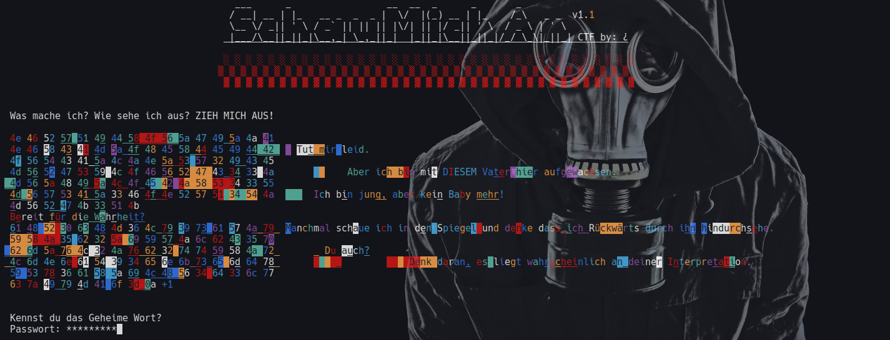

# SchauMichAn.CTF
Ich möchte jeden herzlichst dazu einladen an meinem CTF teilzunehmen. Versuche dieses Rätsel zu lösen.
Die einzigste Voraussetzung: Python 3.x Viel Spaß! 

## Wie kann ich die Challenge beginnen?
- Entpacke die .zip Datei
- lass die .py und den Ordner "pytransform" in dem **selben** Verzeichnis. Ansonsten kannst du 
  die .py Datei **nicht** mehr ausführen.
- Führe die .py Datei "SchauMichAn_CTF_1.1.py" mit <python SchauMichAn_CTF_1.1.py> aus.
    - Je nach Betriebsystem und Umgebung kann sich der Befehl leicht ändern.
    - ! Je nach nach Betriebsystem kann können Funktionen ausfallen und dazu führen das die Challenge nicht lösbar ist. 

Wenn dir das CTF gefällt oder du mit anderen daran rätseln möchtest, wäre es sehr cool wenn du diese Repo teilst damit viele
Leute von der Existenz dieses CTF's bescheid wissen und an diesem Rätsel teilnehmen können.

 ╔════════════════════════════════╗
 ║ Tipp: Denk über die Sätze nach.║
 ╚════════════════════════════════╝
        \   ^__^
         \  (oo)\_______
            (__)\       )\/\
                ||----w |
                ||     ||
-Ar1sto

